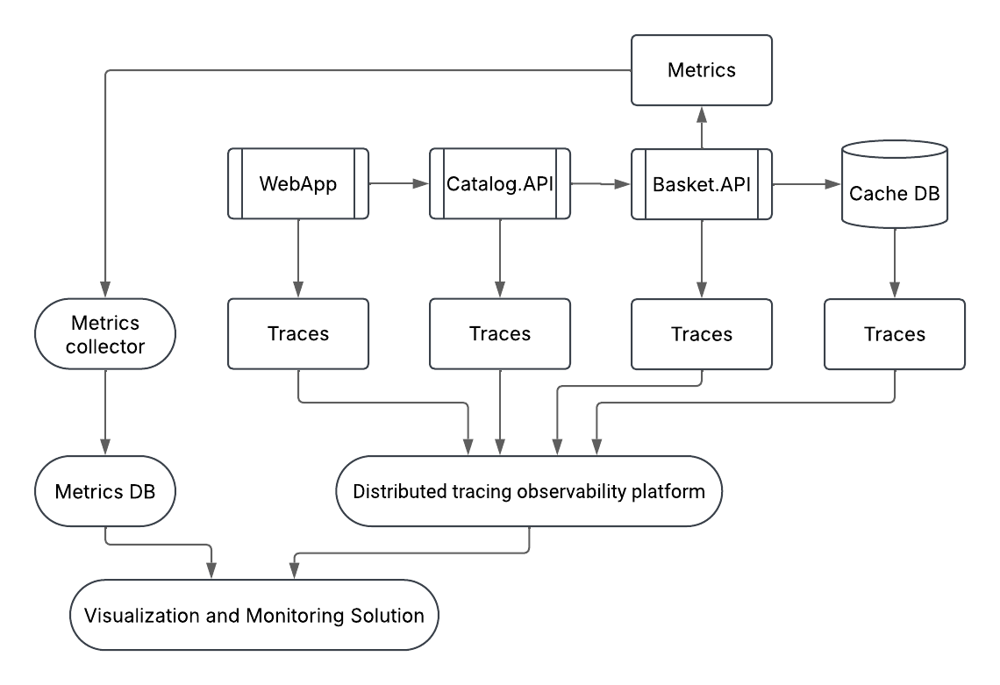
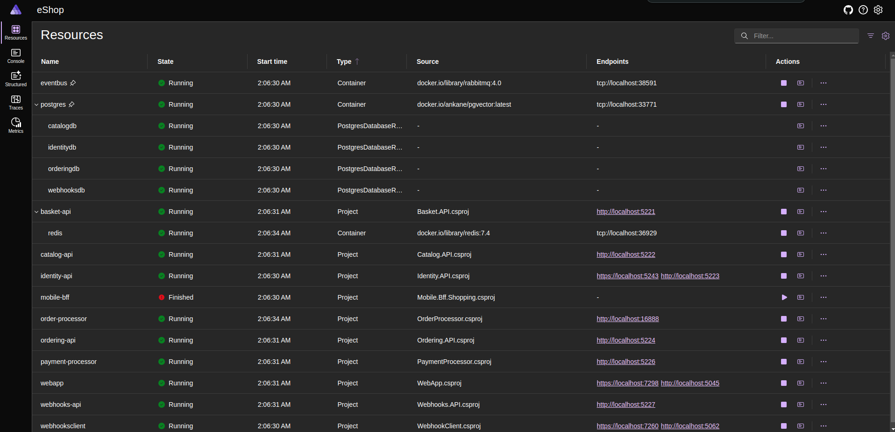
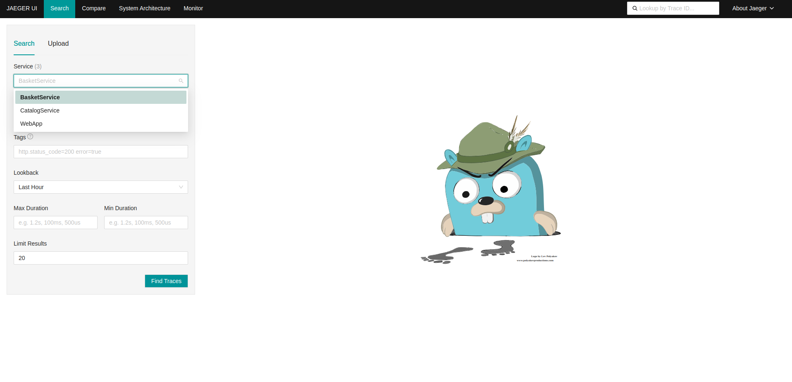
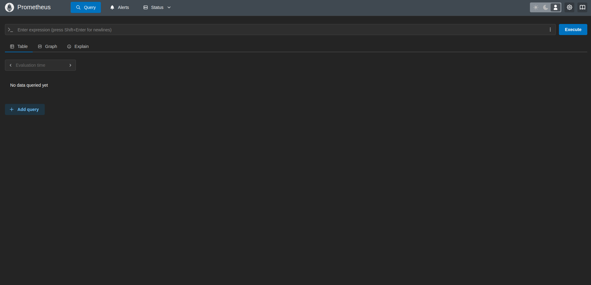
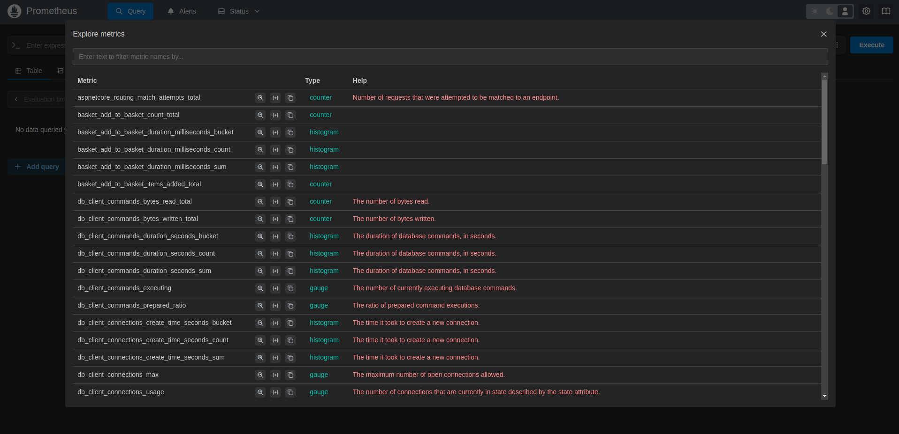
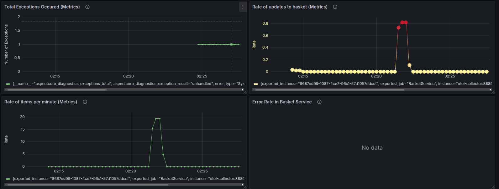
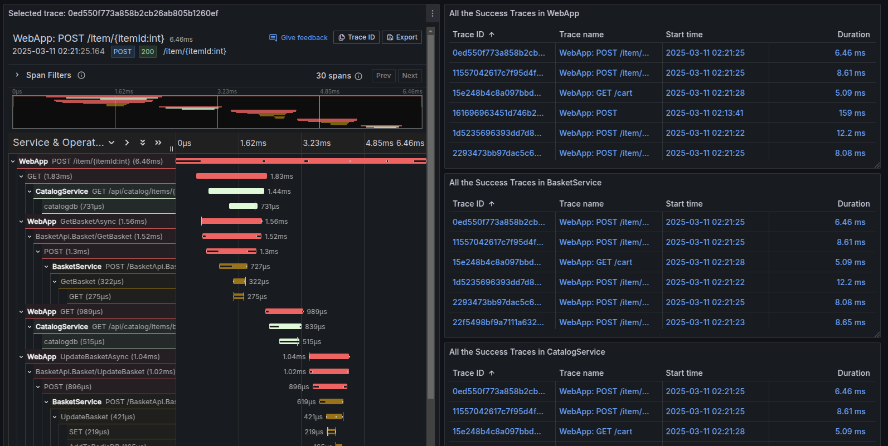

# AS First Individual Assignment

## Objective

- Implement OpenTelemetry tracing on a single feature or use-case (end-to-end).
- Mask or exclude sensitive data (e.g., email, payment details) from telemetry and logs.
- Set up a basic Grafana dashboard to visualize the traces and metrics.
- (Optional Extras) Explore data encryption and compliance in the database layer and introduce column masking for sensitive data.

## Features Implemented

The selected feature for this assignment was add an item to the basket.

1. **Open Telemetry Tracing**: The feature was instrumented with OpenTelemetry to trace the flow of the operation. Instrumented all the layers of the application (API, Service, Repository, and Web Application) to capture the trace and span information. Used custom activity sources for more detailed information.

2. **Data Scrubbing**: No sensitive data was used between the services. However, a class to mask the userID was implemented to show how sensitive data can be scrubbed from the traces.

3. **Tech Stack**: The application was built using .NET 9.0.103. The OpenTelemetry SDK was used to instrument the traces and metrics of the application. Jaeger was used as the tracing backend. An Otel Collector was used to collect the traces and metrics and send them to Prometheus. Grafana was used to visualize the traces and metrics.

## Architecture



### Key Components:

- **WebApp & Basket.API & Catalog.API**: These are application services that handle user requests and business logic.

- **Cache DB**: A caching layer that speeds up data retrieval for Basket.API.

- **Metrics & Metrics Collector**: Metrics are gathered from services and stored in a Metrics DB.

- **Traces**: Each service generates traces (detailed request logs) that are sent to a distributed tracing observability platform.

- **Distributed Tracing Platform**: Aggregates traces from different services to analyze request flows.

- **Visualization and Monitoring Solution**: Provides dashboards and insights using collected metrics and traces.

### Report

The report can be found [here](./docs/AS_1st_Assigment_report.pdf).

### Workflow:

1. The user sends a request to add an item to the basket.
2. The WebApp sends a request to the Basket.API.
3. The Basket.API sends a request to the Catalog.API to get the item details.
4. The Catalog.API sends the item details to the Basket.API.
5. The Basket.API sends the item details to the WebApp.
6. The WebApp displays the item details to the user.

## How to Run

### Prerequisites

- [.NET 9 SDK](https://dot.net/download?cid=eshop)
- [Docker](https://docs.docker.com/engine/install/)
- [Docker Compose](https://docs.docker.com/compose/install/)

### Steps

1. Clone the repository:

```bash
git clone
```

2. Open another terminal at the root of the project and run the following command to start the observability services:

```bash
docker-compose up --build # it can also be docker compose instead of docker-compose depending on the version
```

3. Open one terminal at the root of the project and run the following command to start the application:

```bash
dotnet run --project src/eShop.AppHost/eShop.AppHost.csproj
```

4. In the terminal where the application is running, you will see the following line in the logs if the application is running successfully, you should click on it and navigate to the link of the web app:

```bash
Login to the dashboard at: http://localhost:19888/login?t=uniquelogincodeforyou
```



5. To see the traces in Jaeger, navigate to [http://localhost:16686](http://localhost:16686) and select the service you want to see the traces for.



6. To see the metrics in Prometheus, navigate to [http://localhost:9090](http://localhost:9090) to explore the available metrics.





7. To see the Grafana dashboard, navigate to [http://localhost:3000](http://localhost:3000) and login with the default credentials (admin/admin). You first need to add the datasources for Jaeger and Prometheus, for this just navigate to the "Add new connection" tab, select jaeger and prometheus and assign to each one a connection link, http://jaeger:16686/ and http://prometheus:9090/ .You can import the dashboard from the file `BasketDashboard.json` located in the directory `grafana/dashboards/BasketDashboard.json`. If everything is set up correctly, you should see the traces and metrics in the Grafana dashboard. (If not data is shown, navigate to each dashboard and click on the refresh button and after it save the dashboard);





8. To start seeing data in the dashboard simply add an item to the basket and you will see the traces and metrics in the Grafana dashboard.

